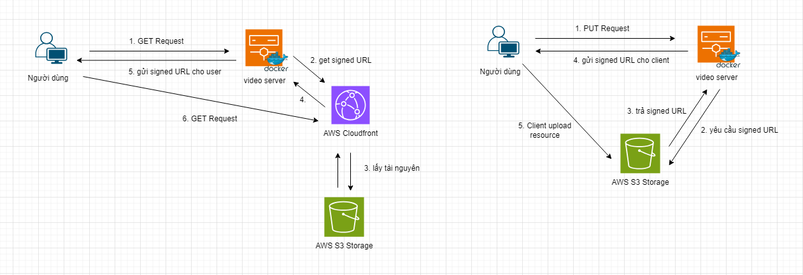

## Ý tưởng khởi đầu (chưa hoàn thiện):

### Sơ đồ:

#### Xem video:

1. User gửi request đến server.
2. Server gửi yêu cầu đến AWS Cloudfront để lấy signed URL của tài nguyên tương ứng.
3. AWS Cloudfront lấy tài nguyên từ AWS S3 Storage.
4. Cloudfront trả signed URL cho server.
5. Server gửi signed URL cho người dùng.
6. Người dùng sử dụng signed URL này để request đến Cloudfront và lấy dữ liệu video.

#### Upload video:

1. User gửi yêu cầu upload qua PUT Request đến server.
2. Server gửi yêu cầu khởi tạo PUT signed request đến AWS S3.
3. AWS S3 nhận yêu cầu, xác thực xem user request có hợp lệ hay không rồi gửi signedURL cho server.
4. Server gửi signed URL cho client.
5. Client dùng signURL này PUT Request đến AWS S3 và thực hiện upload video.

#### Các vấn đề cần tìm hiểu thêm:

- Load Balancer
- Exception handling
- Đây có phải cách tiếp cận đúng?
- Video muốn thay đổi độ phân giải thì dùng thêm service gì?
